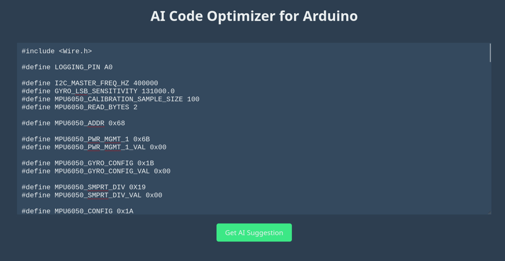
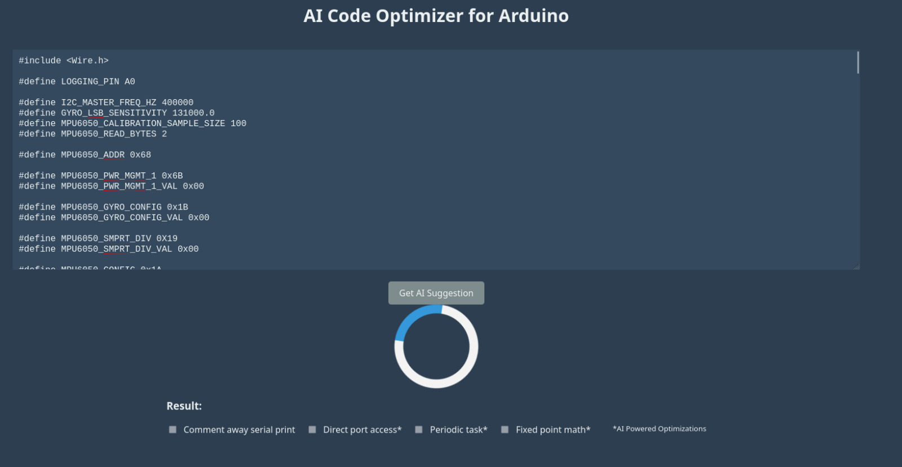
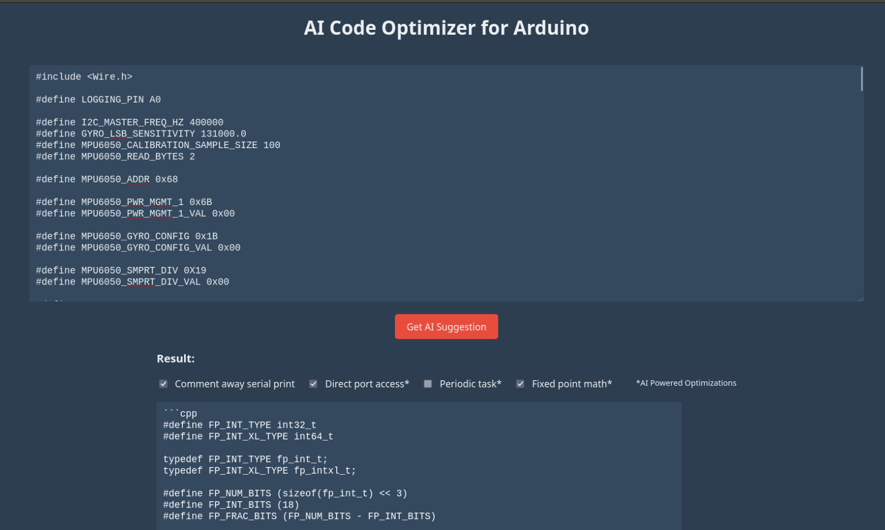

# Western Digital x MUMTEC-36H-Hackathon 2024-
# Anthropos – MUMTEC Hackathon 2024 Submission

## Project Title: Optimizing Horrible Arduino Code

### Table of Contents
1. [Project Overview](#project-overview)
2. [Technologies Used](#technologies-used)
3. [Installation and Setup](#installation-and-setup)
4. [Usage](#usage)
5. [Features](#features)
6. [Architecture](#architecture)


---

### Project Overview

- **Problem Statement**: Inefficient use of Arduino function by the hobbyist community and beginners 
- **Proposed Solution**: An LLM (Large Language Model) will be utilized to optimize the Arduino code through a structured prompt and sequence. This approach aims to minimize errors and mistakes while preserving the readability of the code.

---

### Technologies Used

- Python 3.7
- Groq
- Javascript
- Bun.js
- Arduino UNO


---
### Why pick Groq?
Groq is one of the most accessible and free AI APIs currently available in the market. With its impressive processing speed and diverse range of models, we believe that Groq represents the ideal starting point for developers looking to start their AI journey.

For the models, we selected both **llama3-70b-8192** and **llama-3.1-70b-versatile** as both of them are optimal for their respective tasks.

---
### Installation and Setup
1. **Open Terminal:**
   Navigate to the desired directory where you wish to download the project.

2. **Clone the Repository:**
   Execute the following command to clone the project repository:
   ```bash
   git clone https://github.com/En0chTan/Anthropos-MUMTEC-36H-Hackathon2024.git` 

3.  **Install Dependencies:** Install the required packages by running:
    
    ```bash
    pip install -r requirements.txt` 
    
4.  **Launch the Server:** Start the server by executing:
    
    ```bash
    python backend_http.py`
	
5. **download bun.js:** Enter the following:

    ```bash
    (for windows)
    powershell -c "irm bun.sh/install.ps1|iex"
        
6. **Run the website:** cd into the "frontend" folder and enter the following:

    ```bash
    bun run serve.js
    
6. **Open the website:** go to http://localhost:3000 to view the website

--- 

### Usage
Enter any valid, working arduino code into the website and it will output an optimized code.

1. **Enter code into website**

   
   
   

2. **Observe and feel free to copy the optimized code**
   
   

   Example:
   Unoptimized code can refer to [WD_Hackathon.ino](./WD_Hackathon.ino) <br>
   Optimized version can be found in [WD_Hackathon_Optimized.ino](./WD_Hackathon_Optimized.ino)
--- 

### Features

- The optimized, plug-and-play code should be directly compatible with the Arduino IDE for seamless compilation.
- A simple interface, easy to use and understand
- User experience: Copy the code from the Arduino IDE, paste it into our app for optimization, then paste it back into the Arduino IDE.
- Improve the performance of the main loop, enhancing the overall speed and efficiency.


--- 

### Architecture


The whole code will be provided to LLM, which then it would determine how it would optimize it from the following four: 

- Comment out serial print
- Add Direct Port Access
- Add Periodic Task using millis()
- Implement Fixed Point Math

--- 
